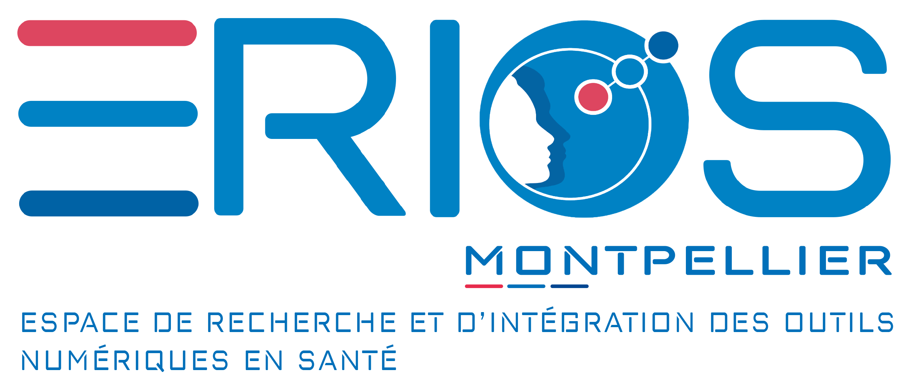

# Consistency in Large Language Models Ensures Reliable Patient Feedback classification

## Overview
 The presented code implements Dual Consistency method with any LLM API for natural language classification.  The given implementation example classifies hospitalized patients feedback among 21 categories and 2 tones, favorable and unfavorable, to identify axes of enhancement in hospital quality of care.

### General Behavior

The Methods send API requests to an available LLM in order to produce consistency metrics. The three methods available are : self-consistency assessment, logLCAl consistency assessment and dual consistency assessment. Self-consistency assessment (SCA) proceeds to a straightforward cross selection. Two LLM runs are directed to classify the text with general prompt engineering methods. Only categories identified twice are kept. LogLCAl consistency assessment (LCA) applies philosophy of logic arguments assessment methods. It directs the LLM to produce two structured Chain of Thought (CoT) encompassing a premise (a citation from the feedback), an implication selected from a predefined, human made list and a conclusion (the identified category). A deterministic algorithm evaluates if the implication given by the LLM can be found attached to the adequate category in the provided list. At least one CoT must present a valid structure to be accepted. Dual consistency assessment applies the two assessments.


## Installation

### Requirements

```bash
python > 3.12
poetry
```

### Install

```bash
poetry install
```

### Configuration

To configure this project, follow the steps below:

1. **Copy the `.env.sample` file:**

   - Make a copy of the file named `.env.sample` and rename it to `.env`.
   - This file contains the necessary environment variables that need to be configured for the project to work.

2. **Fill in the environment variables:**

   In the `.env` file, replace the placeholders with your desired values.

   Example of environment variables:

   ```env
   API_ENDPOINT=http://localhost:11434/v1/
   API_KEY=your-api-key
   MODEL_NAME=llama3-70b
   CATEGORIES_PATH=./datas/categories.json
   OUTPUT_STRUCTURE_PATH=./datas/output_structure.json
   INITIAL_classification_PROMPT_PATH=./datas/initial_classification_prompt.txt
   FEW_SHOT_COT_classification_PROMPT_PATH=./datas/few_shot_cot_classification_prompt.txt
   ```
- **API_ENDPOINT**: This is the URL of the LLM API model.
- **API_KEY**: The API key for accessing the LLM service.
- **MODEL_NAME**: The name of the model used (e.g., `llama3-70b`).
- **CATEGORIES_PATH**: The path to the file containing the classification categories.
- **OUTPUT_STRUCTURE_PATH**: The path to the file defining the structure of the LLM's output.
- **INITIAL_classification_PROMPT_PATH**: The path to the file containing the initial classification prompt.
- **FEW_SHOT_COT_classification_PROMPT_PATH**: The path to the file containing the few-shot CoT (Chain-of-Thought) classification prompt.

3. **Save the `.env` file**:  
After configuring all the necessary variables, save the `.env` file. Your project is now ready to use the correct environment configuration.

## Run

```bash
poetry run python3 main.py --output-dir=<directory-name> --input-csv=<input-csv-path>
poetry run python3 main.py --output-dir=output --input-csv=data/inputs.csv
```
The program's output will be in the output folder of the command.

## License

This tool is licensed under the Apache License, Version 2.0. See [LICENSE](LICENSE) for the full license text.

<hr>
<p align="left">
  
    
    
</p>

